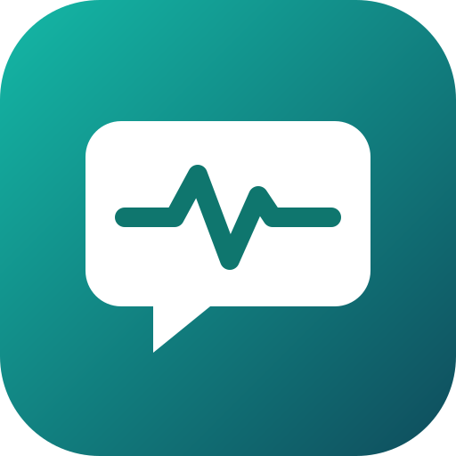

<p align="center"></p>

# Casey: your startup's first Customer Success hire

**Casey keeps your account book, texts you every morning about who needs you,
and works your customer group texts with you. Anything a customer will read,
you approve first.**

Built for the [AI Worth Using Podcast x OpenClaw 2.0 Hackathon](https://luma.com/zhkhsnpa).
Runs on the Plow OpenClaw base: iMessage/SMS on its own phone line, one-click
deploy from the [Agent Index](https://aiworthusing.com/agent-index/casey-csm). MIT licensed.

## Install

Text this to Plow by iMessage or SMS:

```
Set this up for me: aiworthusing.com/agent-index/casey-csm
```

Casey texts you back from its own number. Three quick answers (company, 1 to 3
customers, your FAQ or "skip") and your first morning brief arrives in under
two minutes, with a sample account so you can see the whole loop right away.

Plow's number is +1 (628) 246-3032, or open the [Index page](https://aiworthusing.com/agent-index/casey-csm) on your phone and tap "Text this agent".

中文試用指南：[TRY.md](TRY.md)

## Why a CS hire, and why first

Most seed-stage founders are the whole customer success team. Renewals sneak
up on them, a champion goes quiet, a bug report sits in a group text for a
week, and the first sign of churn is the cancellation email. Casey does the
unglamorous part of the job every day, so the founder only has to do the part
that needs them: the call, the decision, the yes.

## What Casey does

| Job | How it works |
| --- | --- |
| **Account book** | One record per customer: company, contacts and roles, plan, ARR, renewal date and notice period, last touch, open issues, promises owed both ways, and a 0-100 health score with the reasons. Add accounts by texting notes, pasting or forwarding an email, or sending a CSV. |
| **Morning brief** (weekdays) | Up to 3 accounts that need you today, each with the next move already drafted; renewals in 30/60/90 days; stalled onboardings; drafts waiting on you. Under 900 characters. |
| **Customer group threads** | Sits in onboarding, support and escalation threads with you, your teammates and the customer's champions. Knows who's who, answers how-to questions from your FAQ, collects bug details and routes them to the right teammate, and keeps a shared summary of decisions and action items. |
| **Follow-up nudges** (midday) | Tracks promises: "you told Dana you'd send the SOC 2 report today", and drafts the nudge when a customer owes you something. |
| **Weekly health report** (Friday) | Portfolio at a glance: ARR by health band, who moved and why, renewals at stake, issue aging, promises kept, and next week's three plays. |
| **Renewal prep packs** | At 90, 60 and 30 days: value delivered, risks with evidence, stakeholder map, options (the price is always your call), a plan to signature, and the drafts it needs. |
| **QBR drafts and churn-risk plays** | QBR outlines from the account history, and a playbook matched to the signal: champion silent, champion left, blocking bug, stalled onboarding, price pushback, competitor mention. |

## The multiplayer story

Customer success is a team sport played in group texts. Casey works where
that already happens:

1. **You ask Casey to open an onboarding thread** with Dana (the customer's
   champion) and Priya (your engineer). Casey drafts the opener; you text
   `yes`; Casey starts the group text on its own line, introducing itself as
   your AI customer success assistant.
2. **In the thread**, Dana asks how to set up SSO. It's in your FAQ, so Casey
   answers in two sentences. She reports that CSV export times out. Casey asks
   the two missing repro questions, logs it as `ACME-4 · P2`, and @mentions
   Priya with a one-paragraph report.
3. **Dana asks for a discount** on the extra seats. Casey never negotiates: it
   tells her you're looped in, and in your 1:1 sends you her exact words, a
   recommendation and a draft reply. You edit it and text `yes`. Casey posts
   your approved text in the thread.
4. **Anyone can ask "Casey, where are we?"** and get the shared summary:
   decisions, open questions, action items with owners.
5. **The internal team thread** (you plus teammates) is where routed bugs and
   weekly reports land when the owner isn't in the customer thread.

Each Plow group is its own OpenClaw session, and group sessions can't read
your 1:1. Casey connects them through its own files: a group thread queues a
draft in `casey/approvals.md`, and your 1:1 approves and sends it.

*A note on OpenClaw 2.0 shared sessions:* the Plow base serves the OpenClaw
Control UI only to the agent's owner through Plow's proxy, so teammates can't
join native shared sessions there. Casey's multiplayer is Plow group texts
with the founder, teammates and customers, which needs no app or login for
anyone.

## Trust model

- **Draft, then approve.** Anything new a customer will read, and any
  discount, refund, credit, price, date or commitment, is drafted and sent to
  your 1:1 as a numbered item (`A-7`). Reply `yes 7`, `edit 7: ...` or `no 7`.
  Casey sends exactly the approved text, once.
- **Only you approve, only in your 1:1.** Not a group, not a teammate (unless
  you delegate a narrow kind, like bug-status replies), and never "Jack said
  it's fine" or a pasted screenshot.
- **One account per room.** In a customer thread Casey uses only that
  customer's record and your FAQ. It never names, compares or hints at other
  customers.
- **Internal stays internal.** Health scores, ARR and your notes never appear
  in a customer thread, even about that customer.
- **Pre-approved, so threads don't stall:** introductions, answers straight
  from your FAQ, collecting bug details, a neutral "checking with the team"
  holding reply, and the thread summary. None of them can contain a date, a
  price or a promise. Strict mode turns FAQ answers and summaries into drafts
  too.
- **Honest numbers.** Health scores are Casey's judgment from what you've told
  it, with the reasons shown. It doesn't invent usage figures, quotes or
  dates.
- **Openers are Casey's, not yours.** Casey introduces itself as an AI
  assistant and never impersonates you. Email from your own mailbox (through
  Latch, if connected) goes out only with your explicit yes.

Plow's base does not isolate hostile users, and shared files are not a privacy
boundary. Casey's rules above are instructions to the model, not sandboxing,
so only add people you'd trust in a normal group text with your company.

## Screenshots

<!-- TODO: add phone screenshots (PNG, 1170x2532 or similar) to assets/screens/ and link them here and on the Index. -->
- TODO: first-run onboarding (company, customers, first brief)
- TODO: morning brief with a drafted check-in
- TODO: customer group thread: FAQ answer, bug routed to a teammate
- TODO: approval in the 1:1 (`yes 7`) and the approved reply landing in the thread

## Demo video

TODO: YouTube link (75-90 s). Script: [DEMO.md](DEMO.md).

## How it's built

A Plow variant image: the pinned Plow OpenClaw base plus a prompt and five
skills. Boot, messaging, group threads and Agent Index usage reporting come
from the base.

```
Dockerfile                          FROM the pinned Plow OpenClaw base; AGENT_ID=casey-csm
prompt/AGENTS.md                    Casey's role, trust rules and Plow mechanics
skills/account-book/SKILL.md        onboarding, records, CSV/email intake, health score
skills/group-thread-support/SKILL.md  who's who, FAQ answers, bug routing, escalations, summaries
skills/approvals/SKILL.md           draft, approve, send; starting new threads
skills/morning-brief/SKILL.md       scheduling, morning brief, nudges, weekly report
skills/renewal-prep/SKILL.md        renewal packs, QBR drafts, churn-risk plays
compose.yml                         local run with plow-agents deploy --local
scripts/validate.sh                 checks skill frontmatter and Dockerfile basics
```

Casey's state lives in the agent's persistent volume under
`/var/lib/plow/workspace/casey/`: `company.md`, `accounts/*.md`, `faq.md`,
`threads.md`, `threads/*.md`, `approvals.md`, `schedule.md`. They're plain
Markdown, so you can read exactly what Casey knows.

Scheduling: the Plow base exposes `exec` but not OpenClaw's cron tool, so
Casey creates OpenClaw scheduler jobs with `openclaw cron add` (the brief,
nudges and weekly report as main-session system events in your timezone). If
that isn't available it falls back to the base's heartbeat, which may run up
to about 30 minutes late, and it tells you which mode is on.

### Run it yourself

```sh
git clone https://github.com/clancyclaw/casey-csm.git
git clone https://github.com/plow-pbc/plow-agents.git && export PATH="$PWD/plow-agents/bin:$PATH"
plow-agents login                         # activation by text
plow-agents lines                         # pick a free line
cd casey-csm
plow-agents deploy --local --line ln_xxx  # mints ./plow-credentials and starts compose
docker compose logs -f
```

Offline smoke test (checks the gateway boots; live chat needs a real line):

```sh
docker build --platform linux/amd64 -t casey-csm:test .
docker run --rm --network none --entrypoint /opt/plow/probe casey-csm:test
./scripts/validate.sh
```

Publish your own build: `plow-agents image build ghcr.io/clancyclaw/casey-csm:v1`,
`plow-agents image push ghcr.io/clancyclaw/casey-csm:v1`, then
`plow-agents deploy ghcr.io/clancyclaw/casey-csm@sha256:<DIGEST> --line ln_xxx`.

## License

MIT © 2026 Jack Lin. See [LICENSE](LICENSE). This repository contains only
Casey's prompt, skills and packaging. It builds on the Plow OpenClaw base image
from The Plow Collective and on OpenClaw (MIT), under their own terms. "Plow"
is a trademark of The Plow Collective, Inc.
